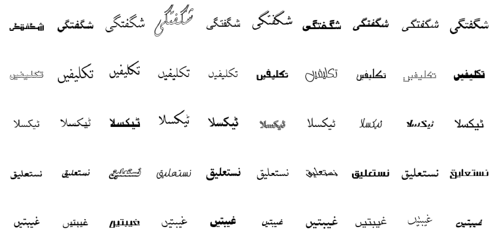

# Qaida
Qaida is a data set of of 18569 ligatures in [Urdu](https://en.wikipedia.org/wiki/Urdu) language synthetically 
generated in 256 different fonts. The data set consists for 3713800 training images and 1039864 test images belonging to 
18569 ligature classes. Each ligature class in the training data images rendered using 200 unique fonts while the test 
data contains each class rendered in 56 fonts. Fonts are kept unique across training and test set making it viable for
 a font-independent OCR system.
 
Here is an example how the data looks (each row represents a different class):


###  Introduction to Urdu Script
Urdu is a subset of [Arabic](https://en.wikipedia.org/wiki/Arabic) language and is written in a cursive script. 
It has 39 letters and is written cursively from right to left. Letters within a word are joined to form a sub-word 
called a ligature. 

### Why we made Qaida
OCR algorithms, have received a significant improvement in performance recently, mainly due to the increase
in capabilities of artificial intelligence algorithms. However this advancement is not evenly distributed over all 
languages. Urdu is also among the languages which did not receive much attention, specially in the font independent 
perspective.
One of the main reason for this, is intra-class variability of the letters in Urdu; unlike English and other Latin based 
languages, letters in Urdu are not constrained to only a single shape. Their shape changes with their position within
the ligature. Number of shapes per letter vary from one to four. There are almost [18,569 valid 
ligatures](http://www.cle.org.pk/software/ling_resources/UrduLigatures.htm) in Urdu which are to be recognized as 
compared to only 52 characters (excluding numbers and punctuations) in English.

Qaida is an attempt to advance the research in font independent printed Urdu test recognition.This data set, to the best of out knowledge is the first large scale multi-font data set for Urdu language. 

### Get the data
| Name  | Content | Classes | Examples | Size | Link | MD5 Checksum|
| --- | --- |--- | --- | --- |--- |--- |
| `train.tar.xz`        | training set images   |18569  | 3713800   |2.6 GBytes      | [Download](https://drive.google.com/file/d/1ihemYqrIDklByJIxk1tKyxg3cISYQIYQ/view?usp=sharing)|`90ffe6411c5147ecc89764909cc6395a`|
| `test.tar.xz`         | test set images       |18569  | 1039864   |461 MBytes      | [Download](https://drive.google.com/file/d/1EvM5SqDruOn1RBHf7vFk2ITS3sze90og/view?usp=sharing)|`847a146ecd9fc2db6e62a38eea475db6`|
| `ligature_map`        | index to ligature mapping|18569  | 18569     | 195.4 KBytes      | [Download](https://drive.google.com/file/d/15DeuaZncztB837WidRKuIuRWrzM981IF/view?usp=sharing)|`0c1b2e60b1c751d1a14c5eb90fec745e`|
| `train_2k.tar.xz`     | training set images   |2000   | 400000    |279 MBytes      | [Download](https://drive.google.com/file/d/1oQk6Hs13JL5OkW2EpS0-zSUAVX7SORzp/view?usp=sharing)|`847a146ecd9fc2db6e62a38eea475db6`|
| `train_2k.tar.xz`     | test set images       |2000   | 112000    | 79 KBytes      | [Download](https://drive.google.com/file/d/196rEKpsLlNOWCoTQv3TVjTnq8nP0FPXr/view?usp=sharing)|`847a146ecd9fc2db6e62a38eea475db6`|
| `ligature_map_2k`        | index to ligature mapping|2000  | 2000     | 21.3 KBytes      | [Download](https://drive.google.com/file/d/1ZHF2AY_DdDfOr2MKnZAsr_mwk61IYG-E/view?usp=sharing)|`37bbd4e44ae486dbb5d7e98801811ae4`|


#### Data format
The training and test data sets are arranged in the following data structure:

```markdown
train
|
├── 0               // directory name is class index
│   ├── 1.jpg
│   ├── 2.jpg
│   └── ...
|
├── 1               
│   ├── 1.jpg
│   ├── 2.jpg
|   └─── ...
|
└── ...

```

#### Mapping directory/class to ligature 
Since the ligatures are in unicode format the directory names are kept as unique integers, starting from 0 to 18568.
The mapping from index to ligature can created using the mapping files present in `./data/ligatures_map` for 18569 classes
 and `./data/ligatures_map_2k` for 2000 classes. These mapping files can be downloaded alongside the data set or can be found in the github repo `\data\`. The code for reading the mapping is follows:
 
```python
import codecs
with codecs.open('./data/ligatures_map', encoding='UTF-16LE') as ligature_file:
    ligatures_map = ligature_file.readlines()

class_idx = 18313
ligature = ligatures_map[class_idx]
print(ligature)

>>>  نستعلیق
``` 

### Loading data
- Pytorch


    [](https://colab.research.google.com/drive/1na46Dw-iZFWTTx9FNKr9eiNhej9TNjRE) for loading and training on first 2000 classes [Warning! GPU instance required]
    
    
    [](https://colab.research.google.com/drive/1OEaZZ13bzB54eaFaw9yvQthuFrDAwa8u) for loading and training on all classes [Warning! TPU instance required]
 
 - Tensorflow
 
    [](https://colab.research.google.com/drive/140f7rKrcgaT3ga-Zg2BXdCgXj2v2AV2p) for loading the dataset in tensorflow 2.0 [Warning! GPU instance required]
 

### Visualization


### Contributing
 Thanks for your interest in contributing! There are many ways to get involved; start with these [open issues](https://github.com/AtiqueUrRehman/qaida/issues) for specific tasks.


### Contributors 
- [Sibt Ul Hussain](https://sites.google.com/site/sibtulhussain/) 
- Atique Ur Rehman

TODO
- [ ] Add data download and extraction script in ./data/
- [ ] Add uses for an OCR system e.g pdf converter
- [ ] Code from loading and training locally
- [ ] Add visualizations
- [ ] Add tutorials for Tensorfow and loading data using Hdf5
